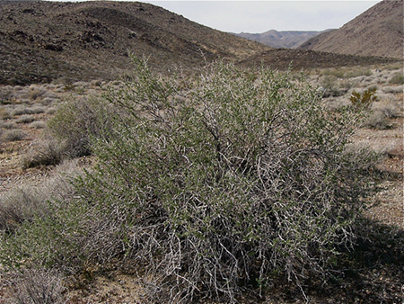
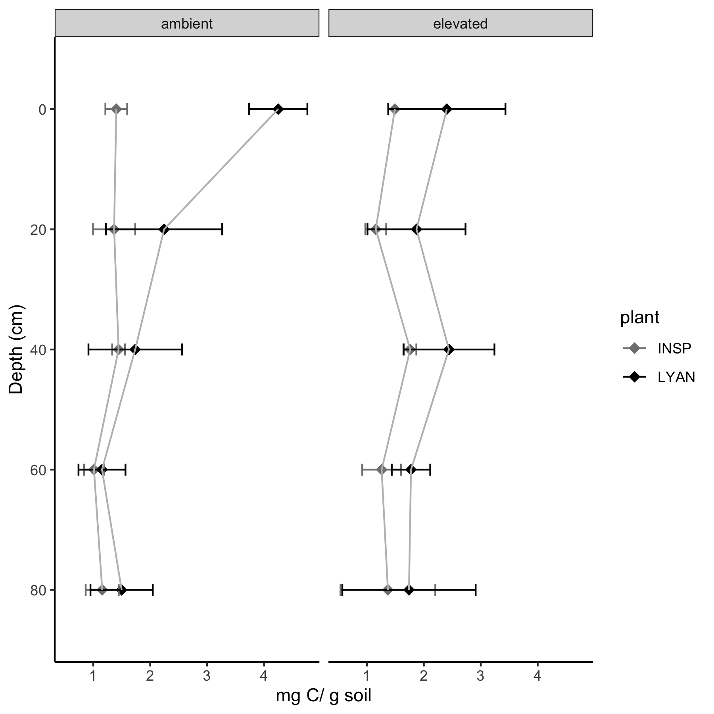
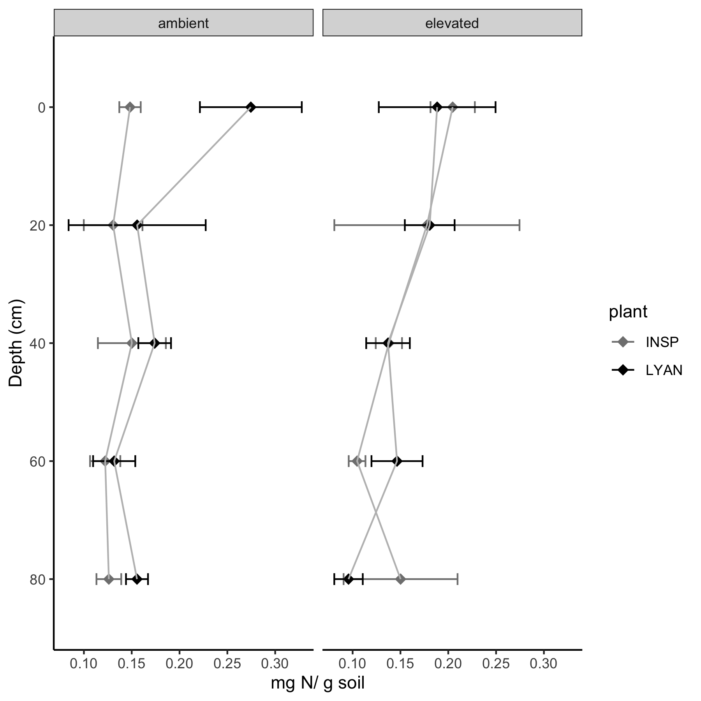

```{r setup, include=FALSE}
knitr::opts_chunk$set(echo = TRUE)
```
L. andersonii's berries are eaten by birds, mammals and livestock. The plant provides good cover for animals

{#id .class width=50% height=50%}

{#id .class width=50% height=50%}

{#id .class width=50% height=50%}