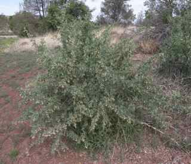
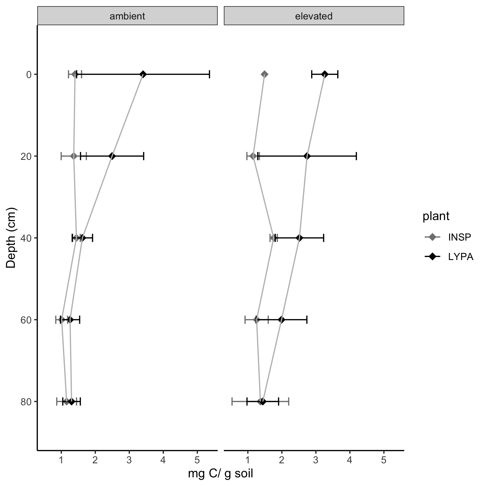
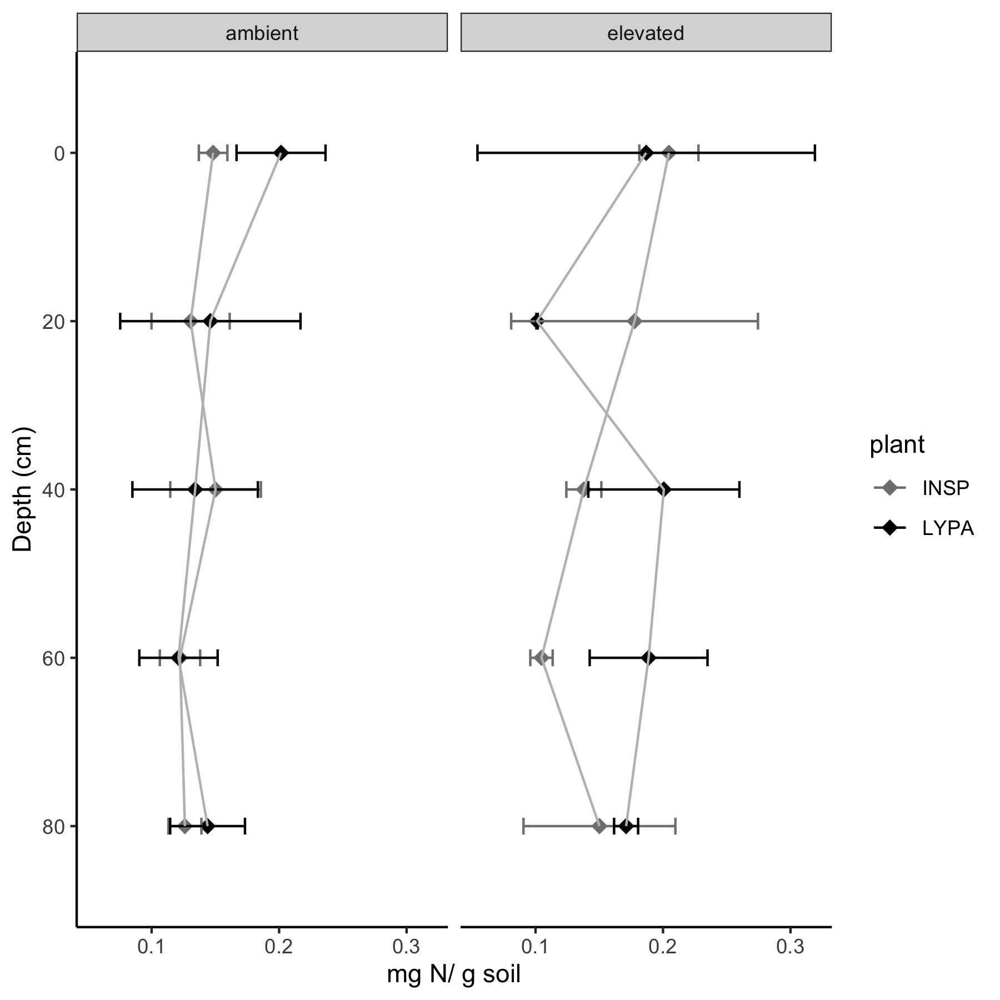

```{r setup, include=FALSE}
knitr::opts_chunk$set(echo = TRUE)
```
L. pallidum's fruits are consumed by birds, rodents and humans. It also serves as cover for birds and small mammals

{#id .class width=51% height=51%}


{#id .class width=50% height=50%}

{#id .class width=50% height=50%}