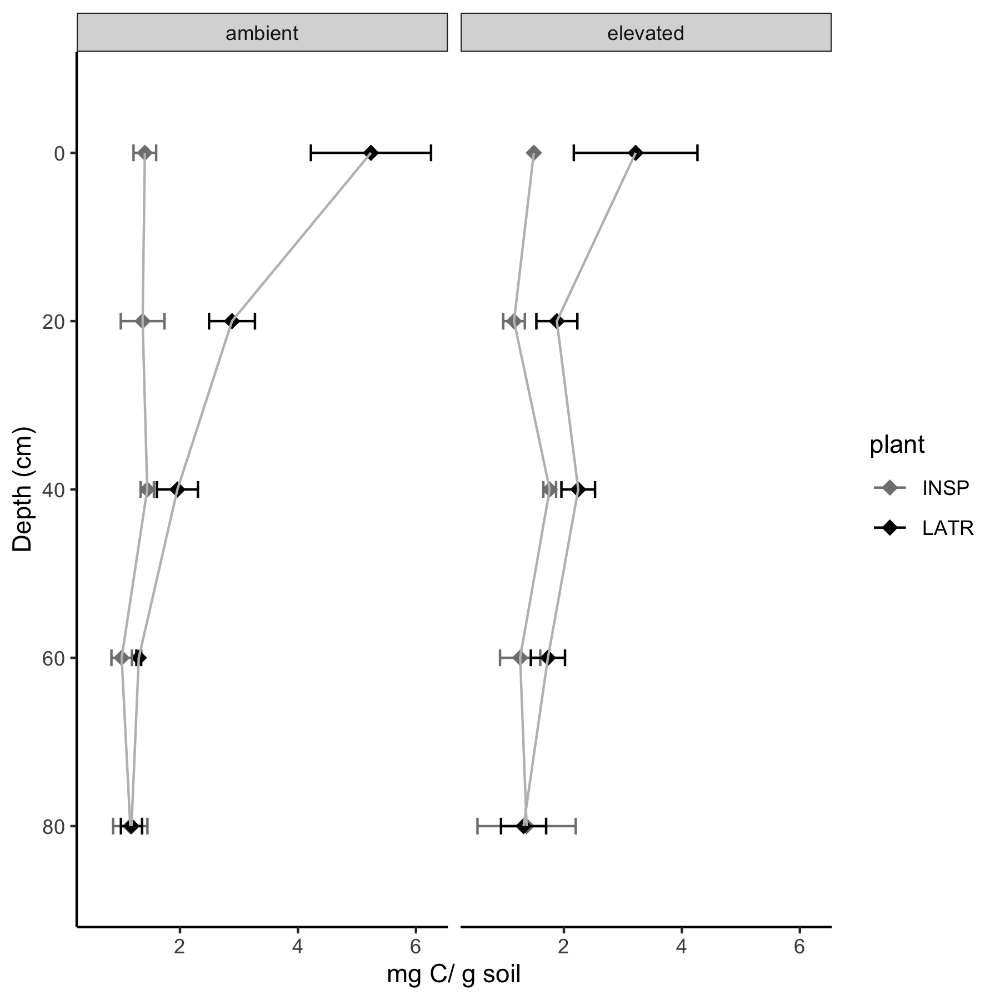

```{r setup, include=FALSE}
knitr::opts_chunk$set(echo = TRUE)
```
Many animals use it to bed and cover under (fox, sheep, kangaroo rat, tortoise). Browsing is also important. Useful for rehabilitation by increasing water filtration, trapping fine soil, organic matter.


{#id .class width=50% height=50%}

{#id .class width=50% height=50%}
{#id .class width=50% height=50%}