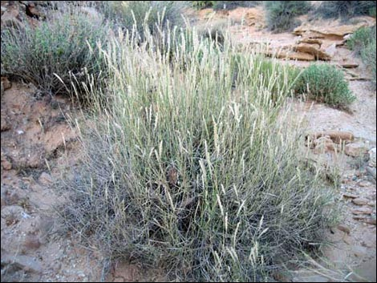
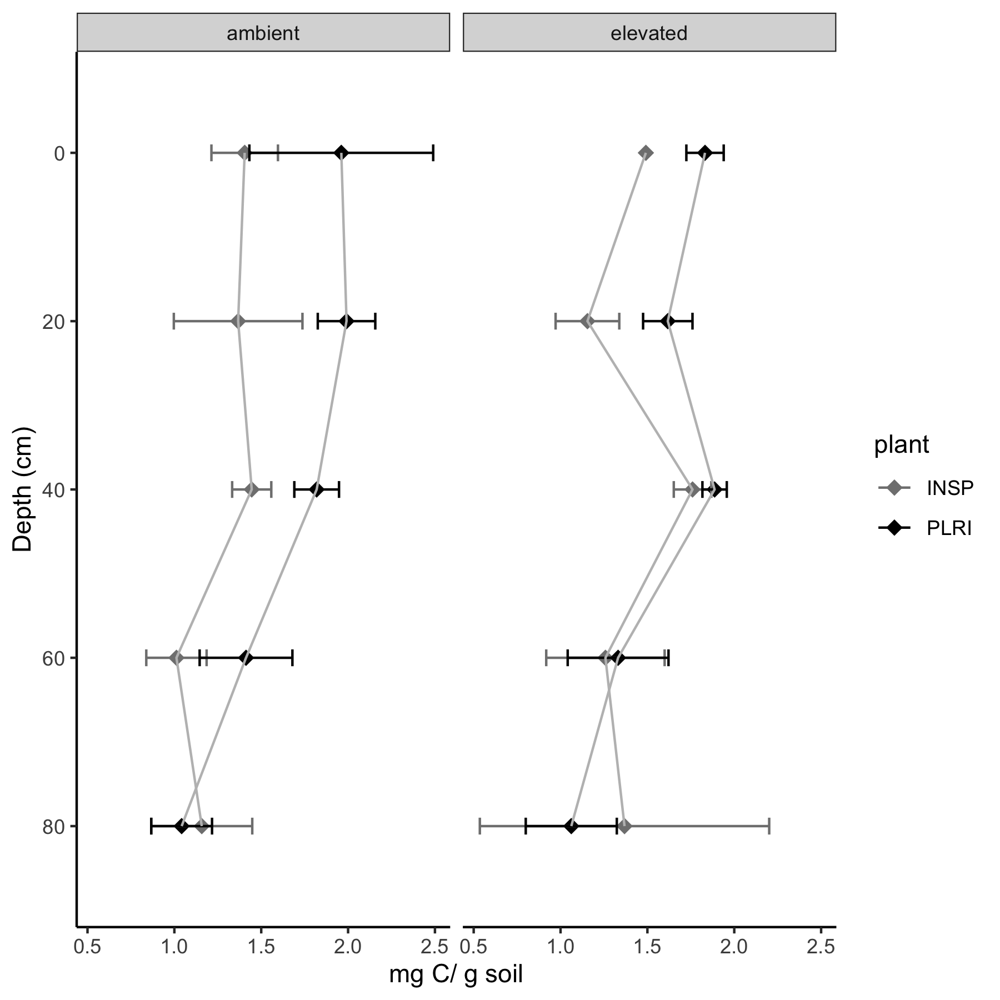
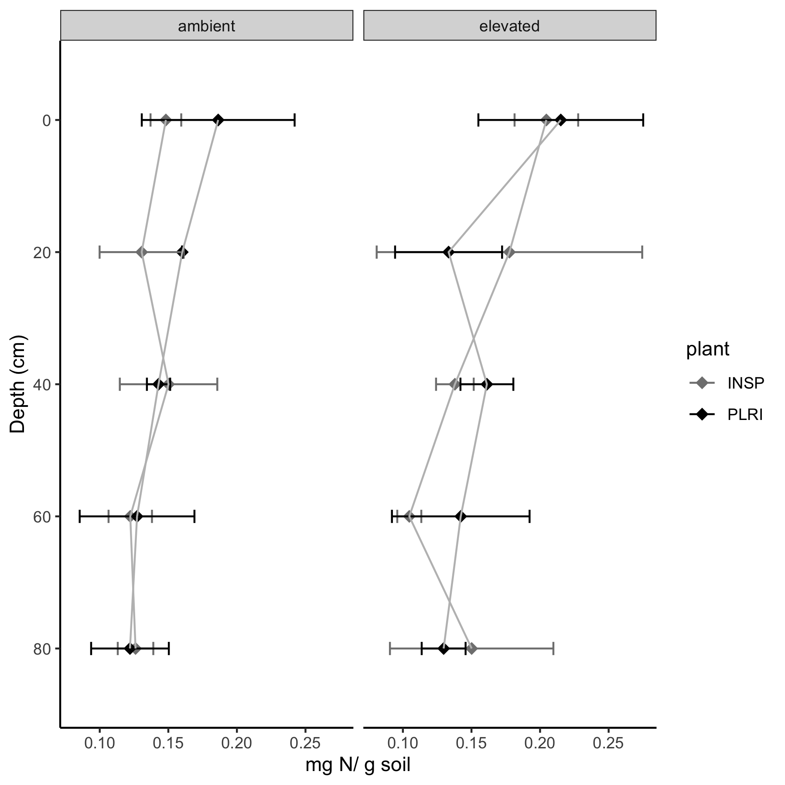

```{r setup, include=FALSE}
knitr::opts_chunk$set(echo = TRUE)
```

P. rigida can be used as a forage plant for livestock, primarily cattle and sheep.

{#id .class width=51% height=51%}

{#id .class width=50% height=50%}
{#id .class width=50% height=50%}