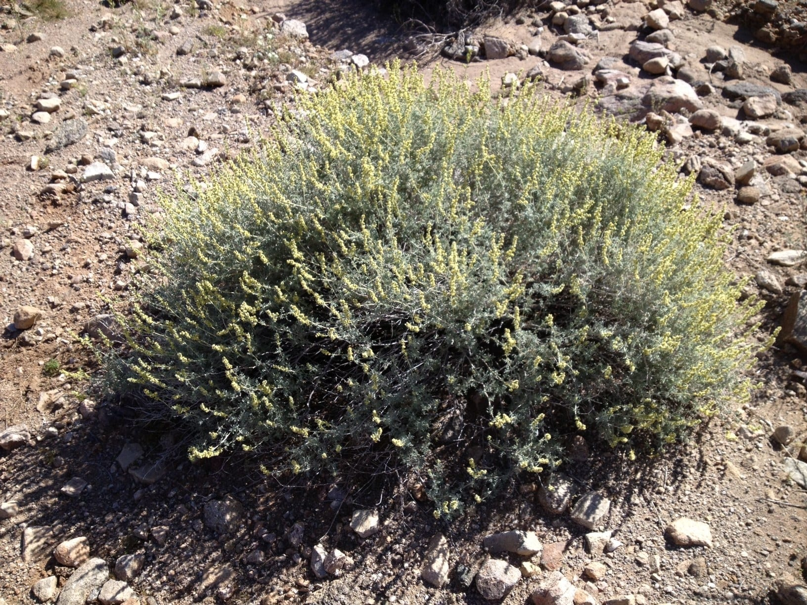

```{r setup, include=FALSE}
knitr::opts_chunk$set(echo = TRUE)
```
Ambrosia is a browse species for black-tailed jackrabbits. It can be used for livestock and heavy browsing pressure in years with low precipitation

{#id .class width=50% height=50%}