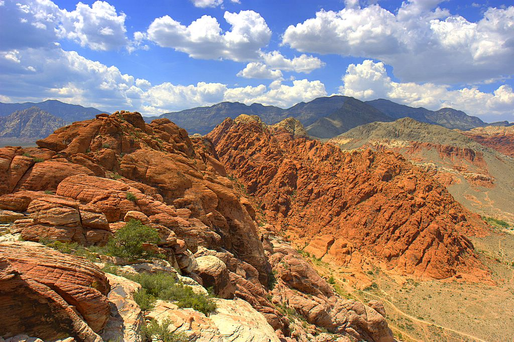
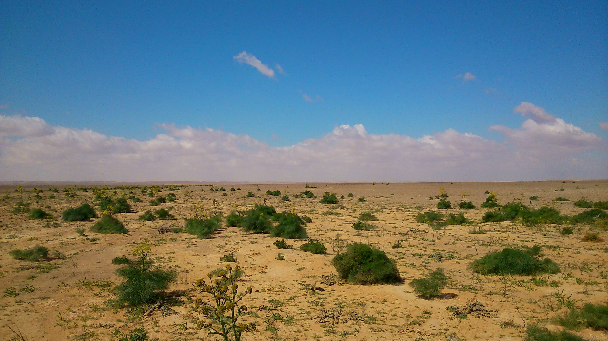

{#id .class width=85% border=10px}

- __What are islands of fertility?:__ Areas with high levels of nutrients and organic matter that form in the soil under canopy trees and shrubs in arid ecosystems.
- __Significance to the ecosystem:__ Islands help promote the persistence of shrubs in the community. Islands make plants resistant to environmental perturbations.
- __How do are they formed?:__ Island formation can result from deposition of plant litter under canopies, soil erosion, rainsplash, nutrient “mining” from interspace soils, symbiotic nitrogen-fixing bacteria, and funneling nutrient-rich stemflow waters
- __How do islands of fertility impact the carbon cycle?:__ Islands of fertility allow for carbon storage in desert ecosystems. Deserts are therefore able to act as carbon sinks thanks to these shrub species.  

{#id .class width=51% height=51%}

- __How will elevated carbon dioxide effect islands of fertility?:__ Initially, we would expect elevated carbon dioxide to increase the island effect, however, there are many factors that interfere with the positive fertilization effects of carbon dioxide.
- __What may be causing the loss in soil carbon and decreased island effect?:__ Desert ecosystems are limited by soil nitrogen. Losses in soil nitrogen under islands of fertility may result in plants being unable to benefit from the increased soil carbon. Other effects include soil moisture. The increased heat due to elevated carbon dioxide and other GCGs will result dryer conditions. 